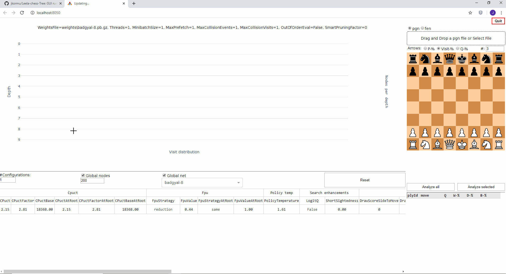

# Leela-chess-Tree
GUI tool for investigating Lc0 search trees.

## Demo


## Features
* Lc0 search tree visualisation
* Load positions from pgn or fen
* allows modifying UCI options (only the ones having effect on the search behaviour)
* board with arrows for visit-%, policy-% or Q-%

## Installation
In order to run LcT you will need:
* LcT executable
* Special build of Lc0 engine capable of writing search trees to disk
* dll files required to run lc0 engine redistributed by lc0-project (Windows)
* At least one lc0 weight file

### Windows
1. Load and extract LcT Windows zip from [LcT's release page](https://github.com/jkormu/Leela-chess-Tree/releases/tag/v0.1)
2. Load Lc0 0.24.1 engine from official lc0 [releases page](https://github.com/LeelaChessZero/lc0/releases) and place the engine folder inside the extracted LcT folder (i.e. inside the folder that holds LcT.exe).
3. Load special version of lc0 engine 0.24.1 from [fork's release page](https://github.com/jkormu/lc0/releases/tag/v0.24.1_gml) that is capable of writing search trees to disk. Replace vanilla lc0.exe with lc0_tree.exe in the engine folder loaded in step 2.
4. Place at least one lc0 weight file inside folder "weights" found inside the extracted LcT folder

LcT can now be launched via LcT.exe which will open LcT in to your default browser.

Notes:
* Step 2. is required for getting the needed dll-files for running the engine as these files are not redistributed along with the lc0_tree engine.
* don't change the name of the "weights" folder
* don't change the name of the "lc0_tree" engine
* do not use lc0_tree.exe for match play or contributing to lc0 project. 
This is because the engine will write search tree after each search which is relatively slow process resulting in slow contribution rate and time losses in match games.

### Linux (easy way)
1. Load and extract LcT for linux from[LcT's release page](https://github.com/jkormu/Leela-chess-Tree/releases/tag/v0.1) 
2. Clone and build special version of lc0 engine 0.24.1 capable of writing search trees to disk:
 ```
git clone -b 0.24_gml --recurse-submodules https://github.com/jkormu/lc0.git lc0_for_lct
cd lc0_for_lct
sh build.sh
```
Place the build folder within LcT folder extracted in step 1 (at the same level with 'LcT' file)
3. Place at least one lc0 weight file inside folder "weights" found inside the extracted LcT folder
LcT can now be launched via LcT executable which will open LcT in to your default browser.

### Linux (by installing dependencies)
1. Download source files from [release page](https://github.com/jkormu/Leela-chess-Tree/releases/tag/v0.1) 
2. Same as step 2. above
3. Install dependencies:
- python                    3.6.10
- dash                      1.4.1
- networkx                  2.4
- python-chess              0.30.1

it is recommended to setup virtual environment, e.g. with conda envs:
 ```
conda create -n my_LcT_env python=3.6
conda activate my_LcT_env
conda install dash=1.4.1 networkx=2.4
pip install python-chess==0.30.1
```
4. Place at least one lc0 weight file inside folder "weights" found inside LcT folder
5. With your python environment activated, navigate to the LcT root folder and run 
 ```
python LcT.py
 ```

## Usage
1. Load position or positions to analyze using one of below methods
    * Upload a pgn-file via drag&drop. This will load positions to the position table from the first game in the pgn file.
    * Upload a position from a fen. Paste fen into fen field and click "Add fen"-button. This will add the position to position table. 
    You can add multiple fens and also delete fen positions via position table's leftmost column.
2. Set lc0-engine configurations you want to use to analyze the position/positions (skip if you wish to use defaults)
    * If you wish to compare more than one set of engine settings increase the number of configuration sets from "#Configurations"-field
    * You can set nodes or network per configuration set by disabling "global nodes" and/or "global net". This will add nodes/network columns into the configuration table.
    * UCI options can be edited through the configuration table.
    * UCI settings can be reseted via "Reset"-button 
    * Notes:
        * Configuration table will do basic validation for the settings but is not fail proof
        * settings out of allowed range are highlighted with red color and before sending to engine the value is clipped back to allowed range
        * LcT does not prevent you from inserting decimal numbers for integer type settings but these are rounded to nearest integer before sending to engine
        * Lc0 may have some special validity requirements for certain parameters that cannot be communicated to LcT via UCI protocol. If you happen to hit such 
        settings, then LcT will unfortunately hang in analysis phase. Please refer to Lc0 documentation to understand valid settings in such cases.
        * LcT, by default, disables smart pruning and sets deterministic settings for threading and batching. This guarantees that identical settings result in identical search trees.
3. Analyze positions either one by one or all at once through the analysis buttons above position table.
4. Once positions are analyzed you can navigate between positions by selecting positions in position table. Configuration sets can be compared through slider below the graph component.
    
